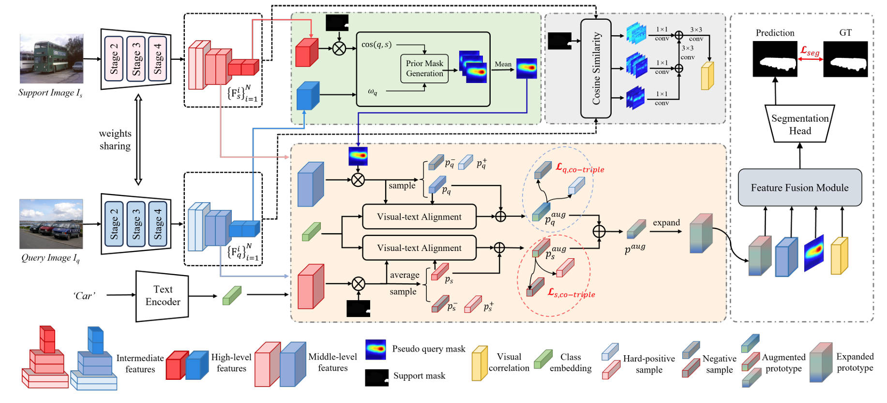

# Sym-Net: Symmetrical Support-query Prototype Learning with Self-Activation Mask for Few-Shot Segmentation

This repository is the official implementation of [Sym-Net: Symmetrical Support-query Prototype Learning with Self-Activation Mask for Few-Shot Segmentation]().

>We present, Sym-Net, a symmetrical support-query prototype learning framework for few-shot segmentation (FSS). Unlike previous works that generate prototypes either from the support or query, our prototypes are formed in a hybrid fashion. In a nutshell, we attempt to inject high-confidence objectquery features (i.e., query prototype) into the support prototypes as complementary information. Since query visual cues are naturally unbiased compared to the few-shot supports, it makes them beneficial for handling intra-class discrepancies. To select the object-relevant regions from a given query, a pseudo query mask is produced by reweighting the support-query matching matrix using a self-activation kernel. Guided by the support and query masks, a co-optimized hard triplet mining strategy is devised for joint optimization, yielding a hybrid prototype. To further enhance the generality of the hybrid prototype, a simpley eteffective visual-text alignment is performed by utilizing an auxiliary class label. Additionally, to overcome the information loss caused by spatial pooling during prototype learning, we incorporate hyper-correlation to capture the multi-scale spatial relationship between the support 
 and query images. Experimental results on PASCAL-$5^i$ and COCO-$20^i$ demonstrate that the proposed HP-Net achieves superior comparable performance to the state-of-the-art FSS models. 




## Get started

### Environment

- python == 3.8.18
- torch == 1.12.0
- torchvision == 0.13.0
- cuda == 11.6

```
pip install -r requirements.txt
```

### Dataset

Please download the following datasets:

- PASCAL-$5^i$：[PASCAL VOC 2012](http://host.robots.ox.ac.uk/pascal/VOC/voc2012/) + [SBD](http://home.bharathh.info/pubs/codes/SBD/download.html)
- COCO-$20^i$：[MSCOCO 2014](https://cocodataset.org/#download)

We follow the data_list generation approach of [PFENet](https://github.com/dvlab-research/PFENet) and pre-divide the training and testing data for each split as  [BAM](https://github.com/chunbolang/BAM). The generated data_lists can be found in the ``./lists/{dataset}/fss_list/`` directory. Please ensure that you uncomment the data list generation sections and generate the base annotation when running the code for the first time. More details refer to `util/get_mulway_base_data.py` and `util/dataset.py`

## Models

We have adopted the same procedures as [BAM](https://github.com/chunbolang/BAM) for the [pre-trained backbones](https://mycuhk-my.sharepoint.com/:f:/r/personal/1155186045_link_cuhk_edu_hk/Documents/HDMNet?csf=1&web=1&e=pXqNWC), placing them in the `./initmodel` directory. At the same time, we've also shared the [trained checkpoints](https://drive.google.com/drive/folders/1-YPZYhYQdHbfdhixWMS1UU31XJ822ECC?usp=sharing) of Sym-Net for everyone to replicate the results presented in our paper. Due to variations in environments and settings, there might be differences in experimental outcomes. Particularly on the PASCAL-$5^i$ dataset, there might be significant fluctuations in results, potentially resulting in an error of around 1%. This phenomenon is less influenced on the COCO-$20^i$ dataset.

## Scripts

- First, update the configurations in `./config`. This may involve making some changes to relative paths to facilitate training or testing.
- Train script

```python
sh train.sh [exp_name] [dataset] [GPUs]

# Example (split0 | COCO dataset | 4 GPUs for traing | nlp model | resume path):
# sh train.sh split0 coco 4 word2vec ./output/pascal/xxxx.pth
```

- Test script

```python
sh test.sh [exp_name] [dataset] [GPUs]

# Example (split0 | COCO dataset | which GPU for testing | nlp model | weight path):
# sh test.sh split0 coco 3 ./output/pascal/xxxx.pth 
```

## References

This repo is built from other excellent contributions:
- PFENet: https://github.com/dvlab-research/PFENet
- BAM: https://github.com/chunbolang/BAM
- HSNet:  https://github.com/juhongm999/hsnet
- SSP: https://github.com/fanq15/SSP
- MIANet: https://github.com/Aldrich2y/MIANet

Expressing sincere appreciation for their great works!
